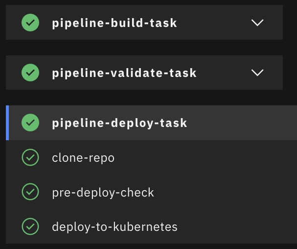

#     Tekton-OpenShift-HelloWorld
_Este repositorio contiene los archivos necesarios para desplegar un "Hola mundo" usando pipelines de Tekton en un cluster de Red Hat Openshift_

## Prerrequisitos
1. Tener una cuenta en [IBM Cloud](https://cloud.ibm.com/) con un grupo de recursos disponible (puede ser el _Default_).
2. Una api key para la cuenta de IBM Cloud.
3. Un cluster de de Kubernetes en la cuenta de IBM Cloud.
4. Tener una cuenta de [GitHub](https://github.com).

## Procedimiento
### Crear servicio de _Continuous Delivery_ en IBM Cloud
En IBM Cloud entre al apartado **Catalog** > **Developer tools** > **Continuous Delivery**.

Llene los siguientes campos:
 - **Select a location**: Selecione la locación donde está su cluster.
 - **Select a pricing plan**: Selecciona la opción _Lite_.
 - **Service name**: Ingrese un nombre para el servicio.
 - **Select a resource group**: Seleccione el grupo de recursos donde está su cluster.
Acepte términos y condiciones y dé click en **Create**

### Clonar/Descargar repositorio de Github
En su cuenta de Github cree un repositorio y copie el contenido de este repositorio.

### Crear servicio de _Toolchain_ en IBM Cloud
En IBM Cloud entre al apartado **Catalog** > **Developer tools** > **Toolchain** > **Build your own**. 

Llene los siguientes campos:
  - **Toolchain name**: Ingrese un nombre para el _toolchain_.
  - **Select region**: Selecione la locación donde está su cluster.
  - **Select a resource group**: Seleccione el grupo de recursos donde está su cluster.
Dé click en **Create**.

### Agregar Github y Delivery Pipeline
Se encontrará en la pestaña **Overview**, dé click en **Add** > **Github**, llené los siguientes campos:
 - **GitHub Server**: Seleccione _Github_.
 - **Auth type**: Seleccione _OAtuh_.
 - **Repository type**: Seleccione _Existing_.
 - **Repository URL**: Ingrese el enlace del repositorio donde copió los archivos de este repositorio.
 - **Git Integration Owner**: Seleccione su nombre de usuario de Github.
 - Deje los demás campos por defecto.
 - Dé click en **Create Integration**.

Ya queda configurado el repositorio, ahora se debe agregar el _Delivery Pipeline_, nuevamente dé click en **Add** > **Delivery Pipeline**, llené los siguientes campos:
  - **Pipeline name**: Un nombre para su _Pipeline_.
  - **Pipeline type**: Seleccione _Tekton_.
 - Dé click en **Create Integration**.
Si no hemos creado el _Continuous Delivery_ o lo creamos en un grupo de recursos distinto, se obtiene un mensaje de advertencia donde nos pedirá crearlo _Continuous Delivery service required_.

### Configuración Delivery Pipeline
En la vista **Overview** obtendremos los nombres de las integraciones creadas.

Dé click sobre la integración del _Delivery Pipeline_. Llene los apartados de la siguiente manera:
 - **Definitions**: Dé click en **Add** y seleccione su repositorio agregado anteriormente y dé click en **Add** > **Save**.
 - **Worker**: Seleccione el _Worker_ público de su locación y dé click en **Save**.
 - **Environment properties**: Dando click en **Add**, agregue las siguientes propiedades de entorno:
   - `apikey`: El apikey de su cuenta de IBM Cloud, esta valor debe ser ingresado como **Secure value** ya que es un acceso directo a los recurso de su cuenta y debe estar oculto en todos los entornos.
   - `cluster`: El nombre de su cluster de Kubernetes.
   - `clusterNamespace`: El nombre del poryecto que se creará en Kubernetes, use el siguiente formato \<su-nombre>-ns.
   - `clusterRegion`: La región de su cluster de Kubernetes, por defecto "us-south".
   - `registryNamespace`: El _namespace_ del registro de contenedores de IBM cloude donde se construirá y se almacenará la imagen a crear, use "tekton-handson".
   - `registryRegion`: La región del registro de contenedores de IBM Cloud, por defecto "us-south".
   - `repository` El repositorio de Github de los recurso (`https://github.com/juandtovar/Tekton-OpenShift-HelloWorld`).
   - `revision`: La rama de los recursos del repositorio, por defecto "master".
  
### Agregar Trigger

Arriba a la izquierda dé click sobre el nombre del _Pipeline_ para volver al apartado del _Delivery Pipeline_, encontrará una ventana de _triggers_ vacía, dé click en **Add** > **Manual**, en el parámetro **Trigger name** agregue un nombre para su _trigger_ y deje el resto de parámetros por defecto y dé click en **Add**.

### Ejecutar el Delivery Pipeline
Se encontrará nuevamente en el apartado de su _Delivery Pipeline_ con el _trigger_ configurado, dé click en **Run** > **Run**, se ejecutará el Pipeline, este proceso toma aproximandamente 3 minutos.

Cuando termine el despliegue verá que el parámetro _Recent runs_ de su trigger tiene un barra verde, al dar click en ella encontrará algo parecido a lo siguiente junto con los _logs_.

### Verificar la creación del Hello World en Openshift
Ingrese a la consola web de Openshift de su cluster, encontrará un proyecto con el nombre del _clusterNamespace_ que configuró, en el apartado **Topology** dé click sobre el botón **Open URL** y encontrará un mensaje "Welcome to IBM Cloud DevOps with Tekton. Let's go use the Continuous Delivery Service". Con esto finaliza el despliegue del hola mundo de Tekton en IBM Cloud.

Autores: IBM Cloud Tech Sales - Juan Diego Tovar Cárdenas.

### Links
Use a Tekton pipeline to build and deploy a simple hello world node application with IBM Cloud Devops ( https://cloud.ibm.com/devops).
